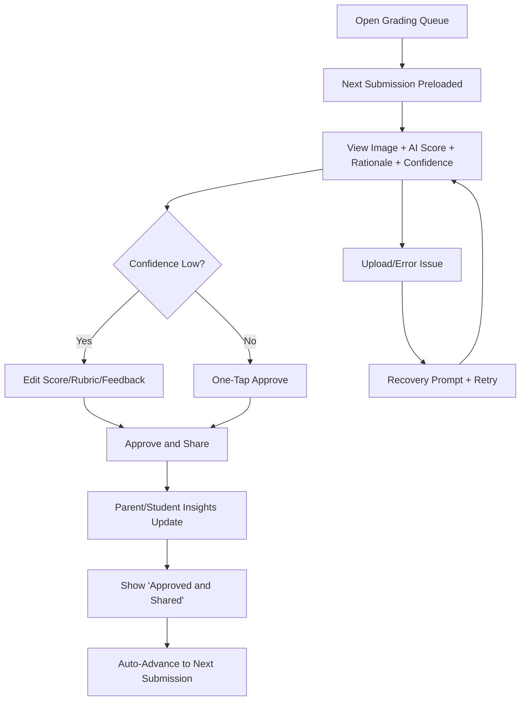
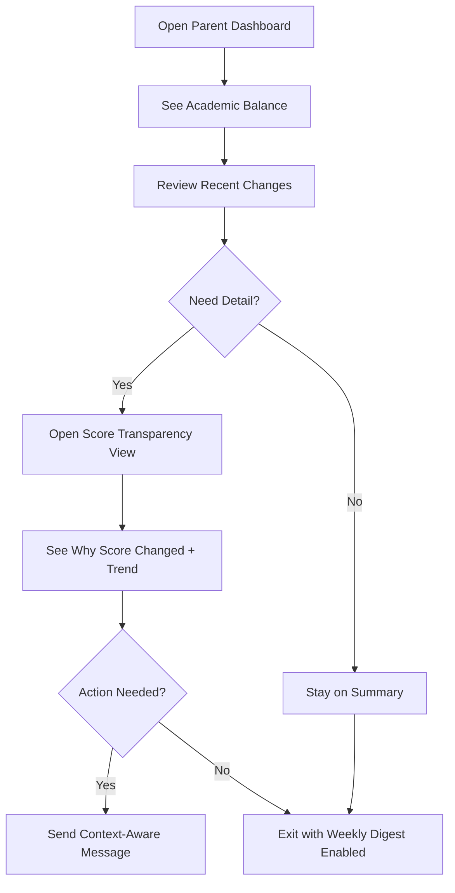
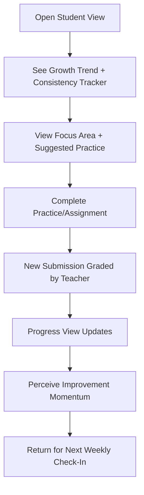

# UX Design Specification - Teacher OS

## Product UX Goals
- Reduce teacher admin burden and cognitive load.
- Give parents proactive clarity with low anxiety.
- Provide principals with org-level decision dashboards.
- Keep navigation role-based and simple on web/mobile.

## Information Architecture
- Teacher App (React Native): Classes, Curriculum Builder, Grading Camera, Student Analytics, Messages, Notifications.
- Parent App (React Native): Child Dashboard, Growth Trends, Alerts, Messages, Suggested At-Home Actions.
- Admin Web Console: Org Dashboard, Cohort Analytics, Communication Health, User/Role Management.

## Core Flows
1. Teacher course creation/customization
- Select grade + subject + state standard profile.
- Generate draft unit/lesson plan.
- Edit objectives, pacing, and assessments.
- Publish to class.

2. Camera grading
- Capture assignment image.
- AI proposes score + rubric mapping + feedback.
- Teacher reviews/edits/approves.
- Score and insight update student dashboard.

3. Parent proactive loop
- Parent receives risk/progress notification.
- Opens child dashboard trend + projection.
- Sends context-aware message to teacher.

4. Org insight loop
- Principal opens weak-subject heatmap.
- Filters by grade/teacher/cohort.
- Reviews communication lag and intervention coverage.

## UX Requirements
- Role-based home screens and permissions.
- Risk indicators with explanation and next action.
- Notification controls (instant/daily/weekly).
- WCAG-minded visual contrast and readable typography.
- Mobile-first for teachers/parents; responsive web for org admin.

## Design System Direction
- Clean, high-trust educational UI.
- Semantic status colors (progress/risk/neutral).
- Consistent card-based analytics surfaces.
- Reusable chart and timeline components.

## MVP Screens
- Teacher: Dashboard, Curriculum Builder, Grading Review, Student Detail, Inbox.
- Parent: Child Overview, Trend/Projection, Alerts, Message Thread.
- Admin: Org Overview, Weakness Heatmap, Communication Health.

## Usability Success Criteria
- Teacher can publish first AI-generated lesson in under 15 minutes.
- Teacher completes grading review cycle in under 2 minutes per submission.
- Parent identifies current risk status in under 30 seconds.
- Admin can isolate weakest cohort in under 60 seconds.

## Executive Summary

### Project Vision
Teacher OS is an AI-assisted K-12 platform where UX success depends first on teacher throughput. The product promise to parents and students ("Is my child improving?") is downstream of teacher-approved grading data, so the MVP UX must prioritize fast, low-friction teacher capture/review/approval while preserving explainability, privacy, and trust.

### Target Users
- Primary MVP UX priority: Teachers
- Secondary users: Parents/guardians and students consuming teacher-approved progress signals
- Tertiary users: Principals/org managers using aggregate insights; admins managing access/governance

### Key Design Challenges
- Designing a teacher-first grading flow that consistently supports under 2 minutes per submission review cycle.
- Supporting high-volume image capture/upload and review without cognitive overload or context switching.
- Preserving role-based simplicity while enforcing strict RBAC/privacy boundaries.
- Meeting WCAG 2.x AA in critical flows across mobile-first teacher/parent experiences.
- Ensuring meaningful low-bandwidth/offline resilience for equity-sensitive usage contexts.
- Making parent risk status discoverable in under 30 seconds while keeping dashboard load performant (<= 3.0s target).

### Design Opportunities
- Turn grading into a rapid triage interaction model: confidence-first review, one-tap approve/edit, and bulk-safe patterns.
- Build trust with explainability surfaces that are concise for teachers and clear for parents.
- Use role-focused IA so each user sees only the next best action, reducing navigation complexity.
- Differentiate with continuity from evidence (submission) to approved score to parent/student insight in one visible chain.

## Core User Experience

### Defining Experience
The core UX of Teacher OS is a teacher-first operational loop: capture student work, review AI-proposed grading, approve quickly, and immediately unlock parent/student visibility. The product's parent-facing promise depends on this loop being consistently fast and reliable, so UX decisions prioritize teacher throughput, confidence, and control over automation.

### Platform Strategy
Teacher OS uses a role-specific multi-platform strategy:
- Mobile-first React Native experience for teachers and parents.
- Responsive web experience for principal/org/admin analytics and governance.
- Touch-first interaction design for teacher grading workflows.
- Low-bandwidth-tolerant patterns and resilience for equity-sensitive environments.
- Strict role-based navigation and access boundaries across all surfaces.

### Effortless Interactions
The following interactions should feel nearly frictionless:
- Assignment capture to AI result display with minimal waiting and no unnecessary context switching.
- Confidence-first review where teachers can approve quickly when confidence is high, and edit with clear controls when needed.
- One-tap approve/edit progression that minimizes taps and repeated data entry.
- Automatic propagation from approved grade to parent/student insights without additional teacher steps.
- Smart defaults for rubric mapping, feedback scaffolding, and notification timing to reduce manual effort.

### Critical Success Moments
Key make-or-break moments are:
- First-time teacher success: complete an end-to-end grading approval cycle quickly and correctly.
- Ongoing teacher trust moment: AI suggestion is understandable, editable, and never removes teacher authority.
- Parent value moment: once approval occurs, risk/progress insight updates are visible and interpretable immediately.
- Failure-sensitive point: any slowdown, ambiguity, or rework in the grading review path risks empty downstream dashboards and reduced adoption.

### Experience Principles
- Teacher Throughput First: protect the under 2-minute grading review cycle in every UX decision.
- Human Authority Over AI: AI accelerates work; teacher approval is always explicit and central.
- One-Loop Continuity: connect evidence to approved grade to insight to communication with no broken handoffs.
- Role-Clarity by Default: each role sees focused navigation and next-best actions only.
- Accessible and Equitable by Design: WCAG 2.x AA critical flows and low-bandwidth-conscious behavior are baseline requirements.
- Explainability Builds Trust: risk/score outputs must be understandable, not just surfaced.

## Desired Emotional Response

### Primary Emotional Goals
- Teacher: Feel decisively in control after every grading cycle, with a secondary sense of relief from reduced admin burden.
- Parent: Feel calm clarity about child progress by default, with urgency only in explicit teacher-escalated situations.
- Student: Feel supported and capable, with progress framed as growth and momentum rather than judgment.
- Org/Admin users: Feel confident and informed when making interventions or policy decisions.

### Emotional Journey Mapping
- First discovery/onboarding
  - Teacher: "This will reduce workload without taking away authority."
  - Parent: "I can understand progress without chasing the teacher."
  - Student: "This helps me improve, not monitor me."
- Core usage moment
  - Teacher: fast, controlled approval flow with clear confidence cues.
  - Parent: understandable score/risk context in plain language.
  - Student: feedback tied to improvement actions and trajectory.
- Post-task completion
  - Teacher: accomplished and in command.
  - Parent: informed and steady, not alarmed.
  - Student: motivated by visible progress.
- When issues occur
  - Teacher: supported by clear exception handling, not overloaded.
  - Parent: guided with context, not panic-triggered.
  - Student: coached toward next steps, not shamed.
- Return usage
  - Reinforce reliability, predictability, and trust through consistent patterns and tone.

### Micro-Emotions
- Teacher: confidence over ambiguity, authority over dependency, relief over backlog stress.
- Parent: trust over skepticism, clarity over uncertainty, steadiness over alarm.
- Student: agency over helplessness, encouragement over self-doubt, belonging over isolation.

### Design Implications
- In control (Teacher) -> explicit approval gates, transparent AI confidence labeling, low-friction edit/override controls.
- Calm clarity (Parent) -> plain-language explanations, trend-first views, restrained alert design and digest defaults.
- Growth mindset (Student) -> longitudinal progress framing, actionable tips, non-punitive language and visual cues.
- Avoid bottlenecking (Teacher) -> self-serve parent/student dashboards, context-linked messaging, reduced repetitive teacher mediation.
- Avoid anxiety loops (Parent/Student) -> suppress noisy micro-fluctuation alerts, escalate only meaningful risk transitions.

### Emotional Design Principles
- Authority With Assistance: AI accelerates decisions; humans retain final control.
- Clarity Before Urgency: default communication informs first, escalates only when warranted.
- Growth Over Surveillance: represent learning as progression, not constant policing.
- Trust Through Explainability: every important score/risk state is interpretable.
- Reduce Emotional Load: interactions should lower stress, not add cognitive or social pressure.

## UX Pattern Analysis & Inspiration

### Inspiring Products Analysis
- Google Classroom (familiar baseline)
  - Strength to emulate: clear assignment lifecycle and low-clutter class structure.
  - Transfer intent: preserve existing teacher mental models (Assigned -> Turned In -> Graded) so adoption friction is minimal.
  - UX lesson: structural familiarity is a speed feature for teacher-first workflows.
- Modern banking apps (Chase/Monzo/Apple Wallet style)
  - Strength to emulate: high-signal summary at top, with transparent recent changes below.
  - Transfer intent: parent dashboard should open with immediate status (academic balance: growth/risk) plus recent meaningful events.
  - UX lesson: configurable push-vs-digest controls reduce anxiety and prevent alert fatigue.
- Fitness/habit trackers (Strava/Apple Fitness/Duolingo style)
  - Strength to emulate: progression framing, streak/consistency loops, and weekly momentum views.
  - Transfer intent: student UX should emphasize improvement trajectory and consistent habits, not isolated scores.
  - UX lesson: agency grows when feedback is framed as progress over time.

### Transferable UX Patterns
- Navigation patterns
  - Chronological, status-driven assignment streams for teacher and parent readability.
  - Role-specific home surfaces with one primary summary card and clear next actions.
- Interaction patterns
  - Binary/explicit state transitions for submissions and grading approvals.
  - Parent notification controls by threshold and cadence (critical push, routine digest).
  - Student consistency indicators (rings/streaks/trend lines) tied to concrete behaviors.
- Visual patterns
  - Clean hierarchy, sparse clutter, and scannable lists for high-frequency teacher usage.
  - What-changed summaries with plain-language explanations for parent trust.
  - Progress-forward visuals that reward momentum and reduce performance shame for students.

### Anti-Patterns to Avoid
- Surveillance-state UX
  - Avoid hyper-granular behavioral tracking that feels punitive or invasive.
  - Do not create parent/student experiences that amplify monitoring anxiety.
- Notification firehose
  - Avoid per-event push for all activity.
  - Batch non-critical alerts into digest formats to prevent tune-out.
- Black-box AI (Magic 8-ball)
  - Never surface AI outputs without rationale.
  - Preserve transparent rubric/explanation context and explicit teacher override authority.

### Design Inspiration Strategy
- What to adopt
  - Classroom-style assignment taxonomy and lifecycle clarity.
  - Banking-style status plus recent changes dashboard model.
  - Fitness-style progress/consistency framing for student motivation.
- What to adapt
  - Notification control models adapted to academic risk thresholds and school context.
  - Progress mechanics adapted for growth framing (not gamification noise).
  - Familiar educational IA adapted for mobile-first teacher speed.
- What to avoid
  - Any pattern that increases surveillance anxiety, overloads notifications, or hides AI reasoning.
  - Any interaction that weakens teacher authority in final grading decisions.

## Design System Foundation

### 1.1 Design System Choice
Established design system for MVP delivery, with disciplined extension points rather than custom-from-scratch components.

### Rationale for Selection
- WCAG 2.x AA baseline is a hard requirement; established systems reduce accessibility implementation risk for complex primitives (forms, dialogs, menus, focus handling).
- MVP success depends on workflow speed and reliability, not bespoke visual novelty.
- Engineering capacity should prioritize differentiating product loops (AI-assisted grading, explainable progress/risk, communication context) over rebuilding solved UI primitives.
- Familiar interaction conventions better support teacher throughput and parent clarity goals.

### Implementation Approach
- Use an established component foundation for both mobile and web surfaces where feasible.
- Build a shared, cross-platform design token layer from day one:
  - Color tokens (semantic + role-aware states: success, warning, risk, neutral)
  - Typography scale tokens
  - Spacing/sizing/radius/elevation tokens
- Map tokens into React Native and web implementations so style changes propagate consistently across teacher/parent/student/admin experiences.
- Keep component usage intentionally conservative for MVP: prioritize predictable patterns and proven accessibility behavior.

### Customization Strategy
- Visual uniqueness priority: low for MVP.
- Apply light branding via tokens (color, type, spacing) without introducing novel interaction paradigms.
- Extend only where product-specific needs demand it:
  - Teacher grading confidence/review controls
  - Parent risk/progress explanation cards
  - Student growth/consistency visualization shells
- Enforce no-hardcoded-style policy in new UI work to protect global consistency and rapid iteration.

## 2. Core User Experience

### 2.1 Defining Experience
The defining interaction for Teacher OS is:

Capture assignment -> AI proposes grade + rationale -> teacher approves/edits -> parent/student insight updates

If this loop is fast, clear, and reliable, the rest of the product value follows.

### 2.2 User Mental Model
Teachers already think in familiar classroom workflow states: assignment issued, work submitted, grading completed, parent visibility enabled.
The UX should match this model directly and avoid introducing new abstractions. Teachers expect:
- clear submission status
- transparent rationale for suggested grades
- explicit final authority before release

Parents expect a what-changed-and-why view, not raw data hunting.

### 2.3 Success Criteria
Core interaction success means:
- teacher completes review/approval in under 2 minutes per typical submission
- low-confidence AI outputs are clearly flagged and easy to correct
- approval instantly triggers updated parent/student insights
- teachers always understand why a suggestion was made

Primary completion signal for teachers:
- clear Approved and Shared confirmation with immediate next action (next submission in queue)

### 2.4 Novel UX Patterns
This should be mostly established patterns with one focused innovation:
- established: chronological lists, status-based states, review/approve workflow, clear confirmations
- innovation: confidence-first grading review that triages attention to low-confidence cases while keeping high-confidence approvals one-tap

This minimizes learning friction while still delivering differentiated speed.

### 2.5 Experience Mechanics
1. Initiation
- teacher opens grading queue from class dashboard
- next unreviewed submission is preloaded

2. Interaction
- teacher views image, rubric mapping, score suggestion, confidence indicator, rationale
- teacher either approves immediately or edits score/rubric/comments

3. Feedback
- system confirms validity in real time (no hidden state changes)
- low-confidence warnings are explicit and actionable
- errors provide recovery options without losing work

4. Completion
- teacher sees Approved and Shared state
- parent/student dashboard updates are reflected
- flow auto-advances to next submission to preserve pace

## Visual Design Foundation

### Color System
- Base direction: neutral, high-trust, low-cognitive-load palette.
- Primary: deep blue for actionable controls and navigation.
- Secondary: slate/gray for structure and non-critical UI chrome.
- Success: muted green (progress, approved states).
- Warning: amber (attention needed, non-critical issues).
- Risk/Error: warm orange-red reserved for true risk/escalation only.
- Info: cool blue-cyan for explanatory callouts.
- Surface system: layered whites/light grays for card-based dashboards.
- Semantic mapping rule: never use risk color as decorative accent; reserve it for meaningful alerts.

### Typography System
- Tone: professional, calm, readable.
- Primary font: Inter (or system fallback on mobile if performance constraints require).
- Scale: clear, restrained hierarchy (H1/H2/H3/body/small/caption) optimized for dense operational screens.
- Readability defaults: body text tuned for scanability in teacher grading flows; high-contrast labels for status and confidence tags.
- Numerical clarity: tabular numeral style for scores/trends where available.

### Spacing & Layout Foundation
- Base spacing unit: 8px token grid.
- Density profile:
  - Teacher grading screens: medium-dense for throughput.
  - Parent/student dashboards: medium-airy for comprehension and calm tone.
- Layout model: card + list hybrid with strong section headers and predictable status rows.
- Tokenized structure: spacing/radius/elevation all derived from shared tokens across RN + web.

### Accessibility Considerations
- WCAG 2.x AA contrast minimum enforced on all semantic states.
- Do not communicate status by color alone; pair with icon + label + helper text.
- Touch targets sized for reliable one-handed teacher use.
- Typography and spacing support dynamic text scaling without layout breakage.
- Error and low-confidence states include actionable remediation text, not just warnings.

## Design Direction Decision

### Design Directions Explored
We explored 8 variations covering:
- teacher queue density and grading speed patterns
- parent balance plus recent changes clarity models
- confidence-triage review layouts
- split evidence/rubric review composition
- student growth narrative views
- admin cohort insight surfaces
- mobile one-hand interaction models
- explainability-first presentation styles

### Chosen Direction
Direction 1 - Compact Queue First is selected as the base direction.

### Design Rationale
- Best aligns with the MVP's teacher-first throughput goal.
- Supports the under 2-minute grading-review objective with minimal navigation overhead.
- Reinforces familiar status-driven patterns from existing teacher workflows.
- Keeps visual novelty low while preserving clear semantic signaling.

### Implementation Approach
- Use Direction 1 as the core shell for teacher grading flows.
- Blend in:
  - confidence-triage cues from Direction 3 (for low-confidence prioritization)
  - explicit explainability panel behavior from Direction 8 (for trust and transparency)
- Preserve tokenized color/typography/spacing foundation from Step 8.
- Keep parent/student/admin surfaces visually consistent but role-appropriate in density.

## User Journey Flows

### Teacher - Capture to Approved Share
Teacher flow prioritizes speed, confidence triage, and explicit authority.

### Parent - Calm Clarity Progress Check
Parent flow optimizes quick understanding with controlled alerting.

### Student - Growth and Consistency Loop
Student flow reinforces agency and progress, not surveillance.

### Journey Patterns
- Status-first navigation and clear progression states
- Confidence-based branching only when needed
- Single primary action per screen
- Explainability at decision moments
- Auto-advance after successful completion

### Flow Optimization Principles
- Minimize taps and context switching in teacher grading
- Keep parent dashboard summary-first, detail-on-demand
- Batch non-critical alerts into digest channels
- Always provide recovery paths for upload/network failures
- Preserve human authority checkpoints before visibility changes

## Component Strategy

### Design System Components
Use established-system primitives for:
- Buttons, inputs, selects, modals, sheets, tabs, toasts
- Cards, lists, badges, chips, avatars, table/grid primitives
- Form validation, focus states, keyboard navigation, aria scaffolding
- Token-driven typography, spacing, color semantics

### Custom Components

### Grading Confidence Panel
**Purpose:** Prioritize teacher review effort by confidence.  
**Usage:** Inside grading queue/detail view.  
**Anatomy:** confidence badge, rationale summary, risk flag, quick actions.  
**States:** high-confidence, low-confidence, error, loading.  
**Variants:** compact (queue row), expanded (detail panel).  
**Accessibility:** screen-reader confidence label + rationale; keyboard focus order.  
**Content Guidelines:** concise explanation first, details on expand.  
**Interaction Behavior:** one-tap approve for high-confidence, forced review path for low-confidence.

### Score Transparency Card
**Purpose:** Explain "why this score" for parents/students.  
**Usage:** Parent/student detail pages.  
**Anatomy:** score delta, rubric factors, trend context, teacher note.  
**States:** stable, improving, declining, insufficient data.  
**Variants:** summary card, full-detail panel.  
**Accessibility:** semantic headings, chart alt text, color+icon labels.  
**Content Guidelines:** plain language; avoid ML jargon.  
**Interaction Behavior:** tap to expand rationale and linked evidence.

### Consistency Tracker
**Purpose:** Show student momentum without surveillance framing.  
**Usage:** Student home + parent snapshot.  
**Anatomy:** streak/consistency metric, trend sparkline, focus habit.  
**States:** improving, flat, at-risk, recovering.  
**Variants:** mini widget, full trend block.  
**Accessibility:** text equivalents for all visual signals.  
**Content Guidelines:** growth-forward language.  
**Interaction Behavior:** tap for historical view and suggested next action.

### Notification Preference Matrix
**Purpose:** Let parents choose push vs digest by severity.  
**Usage:** Settings + onboarding.  
**Anatomy:** event types, threshold rules, cadence selectors, preview.  
**States:** default, customized, conflict warning, saved.  
**Variants:** guided setup, advanced editor.  
**Accessibility:** fully keyboard operable toggle groups and explicit labels.  
**Content Guidelines:** emphasize calm defaults and critical-only push.  
**Interaction Behavior:** immediate preview of resulting notification behavior.

### Component Implementation Strategy
- Build all custom components on top of design-system primitives and shared tokens.
- Keep logic and presentation separable for RN/web reuse.
- Encode semantic states centrally (success/warning/risk/info) to prevent drift.
- Add accessibility acceptance checks per custom component before release.
- Define component contracts early (props/events/state machine) for consistent usage.

### Implementation Roadmap
- **Phase 1 - Core MVP Critical**
  - Grading Confidence Panel
  - Score Transparency Card
- **Phase 2 - Engagement & Control**
  - Notification Preference Matrix
  - Consistency Tracker (summary)
- **Phase 3 - Enhancements**
  - Expanded Consistency Tracker analytics
  - Advanced transparency drill-down variants

## UX Consistency Patterns

### Button Hierarchy
- **Primary buttons:** one per screen max, reserved for critical progression (`Approve and Share`, `Save`, `Continue`).
- **Secondary buttons:** supporting actions (`Edit`, `View Details`).
- **Tertiary/text actions:** low-priority utilities (`Cancel`, `Learn More`).
- **Destructive actions:** visually distinct risk style + confirmation guardrail.
- **Mobile rule:** bottom-anchored primary action in high-frequency flows.
- **Accessibility:** visible focus state, minimum touch target, non-color differentiation.

### Feedback Patterns
- **Success:** concise confirmation + resulting system effect (`Approved and Shared`, dashboard updated).
- **Warning:** actionable caution for recoverable issues (low confidence, missing field).
- **Error:** clear problem + recovery path (`Retry upload`, `Save draft`).
- **Info:** neutral context and explainability hints.
- **Pattern rule:** every error/warning must include next best action.
- **Timing:** transient toasts for minor success, persistent inline banners for blocking issues.

### Form Patterns
- **Validation timing:** inline for format checks, on-submit for cross-field logic.
- **Error placement:** at field + section summary for long forms.
- **Defaults:** sensible prefill where confidence is high; always editable by teacher.
- **Required fields:** clearly marked with helper text.
- **Submission safety:** prevent double-submit, preserve state on failure.
- **Accessibility:** labels bound to controls, error text announced, keyboard/assistive support.

### Navigation Patterns
- **Role-first IA:** each role gets focused home and task paths.
- **Status-first lists:** chronological + state chips in queue-driven views.
- **Progressive disclosure:** summary first, drill-down on demand.
- **Back behavior:** predictable return to prior context with preserved filters/scroll.
- **Cross-role consistency:** same structural rhythm, role-specific density.
- **Mobile:** thumb-zone primary actions and shallow depth in critical flows.

### Additional Patterns
- **Modal and overlays**
  - Use for short, high-focus decisions only.
  - Never block critical grading work with non-essential prompts.
- **Empty states**
  - Always include reason + next action (`No pending submissions`, `Capture first assignment`).
- **Loading states**
  - Skeletons for content blocks; explicit progress labels for uploads/AI processing.
- **Search and filtering**
  - Persistent filters in queue views; quick reset to safe defaults.
- **Custom pattern rules**
  - Human authority checkpoint before parent/student visibility changes.
  - Calm-by-default notification UX (critical push, routine digest).
  - Explainability always adjacent to AI-driven outcomes.

## Responsive Design & Accessibility

### Responsive Strategy
- **Mobile-first baseline** for teacher/parent/student workflows (React Native surfaces).
- **Desktop-enhanced layouts** for admin/org dashboards (multi-panel, denser analytics).
- **Tablet strategy**: touch-optimized two-pane where useful (e.g., evidence + rubric review).
- Teacher-critical screens prioritize one-hand operation and persistent primary action access.
- Parent screens prioritize summary-first clarity, detail-on-demand expansion.

### Breakpoint Strategy
- **Web breakpoints (admin):**
  - Mobile: `320-767`
  - Tablet: `768-1023`
  - Desktop: `1024+`
  - Wide analytics: `1280+` (optional dense data views)
- **Approach:** mobile-first CSS/query strategy for web; token-driven adaptive spacing/type scale across RN + web.
- **Layout behavior:** preserve information hierarchy across breakpoints; avoid hiding critical actions behind extra taps.

### Accessibility Strategy
- Target **WCAG 2.x AA** as required baseline across core flows.
- Enforce contrast minimums (4.5:1 text; 3:1 large text/UI where applicable).
- Ensure full keyboard support on web and assistive-tech compatibility.
- Touch targets minimum 44x44 equivalent on mobile.
- Non-color status communication (icon + text + semantic labels).
- Screen-reader narration for confidence/risk states and score rationale.
- Focus management for modals, alerts, and post-submit confirmations.

### Testing Strategy
- **Responsive testing**
  - Real-device checks on representative phone/tablet classes.
  - Cross-browser web testing (Chrome, Firefox, Safari, Edge).
  - Network-throttled testing for low-bandwidth behavior.
- **Accessibility testing**
  - Automated audits (axe/lighthouse equivalents).
  - Keyboard-only navigation scripts.
  - Screen reader verification (VoiceOver + NVDA baseline).
  - Color contrast and color-blind simulation checks.
- **Scenario testing**
  - Teacher grading cycle under time target.
  - Parent risk discovery under 30-second target.
  - Error recovery flows (upload failure, low-confidence review).

### Implementation Guidelines
- Use semantic structure and accessible component primitives from chosen design system.
- Keep all spacing/type/color values tokenized; no hardcoded style drift.
- Provide explicit labels, helper text, and inline validation for forms.
- Ensure loading/error/empty states are always actionable.
- Preserve state on interruptions (network drop, app backgrounding).
- Add accessibility checks to CI and definition-of-done for all new UI work.
